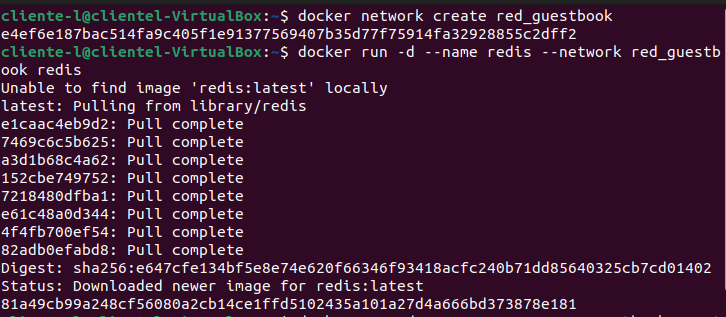
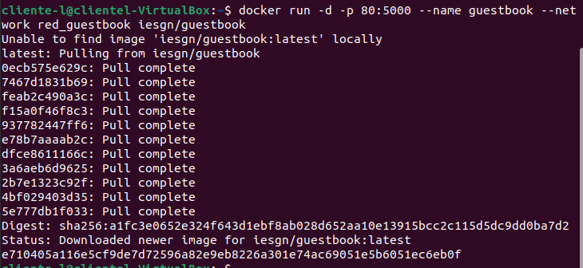

# Ejercicios de Redes

[TOC]

> Realizado por: Laura Suárez Suárez

## Despliegue de la aplicación
Guestbook

Creamos los contenedores en la misma red y ejecutamos los contenedores:

```bash
$ docker network create red_guestbook
$ docker run -d --name redis --network red_guestbook redis
$ docker run -d -p 80:5000 --name guestbook --network red_guestbook iesgn/guestbook
```

 

 

Y entramos:


## Despliegue de la aplicación Temperaturas

Creamos una red para conectar los dos contenedores:

```bash
$ docker network create red_temperaturas
```


Y ejecutamos los contenedores:

```bash
$ docker run -d --name temperaturas-backend --network red_temperaturas iesgn/temperaturas_backend
$ docker run -d -p 80:3000 --name temperaturas-frontend --network red_temperaturas iesgn/temperaturas_frontend
```


## Despliegue de Wordpress + mariadb

Creamos la red:

```bash
$ docker network create red_wp
```


Ejecutamos los siguientes comandos para crear los dos contenedores:

```bash
$ docker run -d --name servidor_mysql \
--network red_wp \
-v /opt/mysql_wp:/var/lib/mysql \
-e MYSQL_DATABASE=bd_wp \
-e MYSQL_USER=user_wp \
-e MYSQL_PASSWORD=asdasd \
-e MYSQL_ROOT_PASSWORD=asdasd \
mariadb
$ docker run -d --name servidor_wp \
--network red_wp \
-v /opt/wordpress:/var/www/html/wp-content \
-e WORDPRESS_DB_HOST=servidor_mysql \
-e WORDPRESS_DB_USER=user_wp \
-e WORDPRESS_DB_PASSWORD=asdasd \
-e WORDPRESS_DB_NAME=bd_wp \
-p 80:80 \
wordpress
$ docker ps
```


